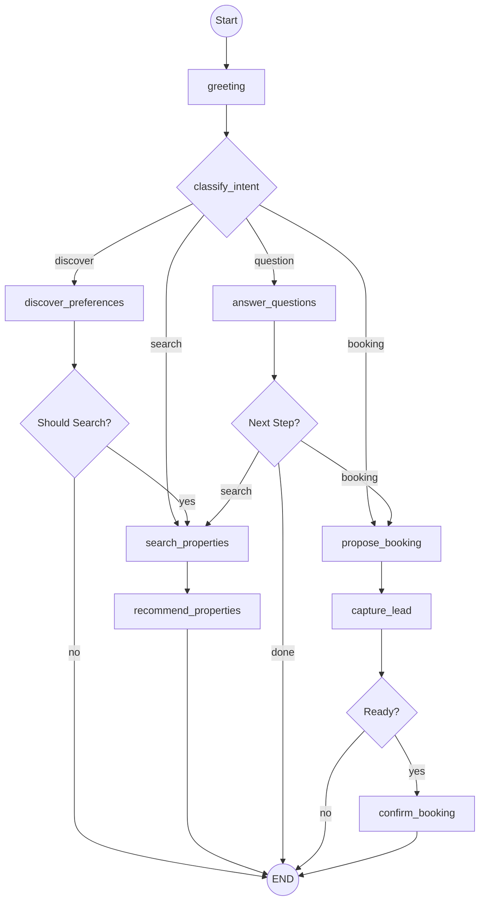

# Silver Land Properties - Conversational AI Engine 

A production-grade, state-of-the-art conversational AI agent for luxury property sales. Built with **LangGraph** for sophisticated dialogue management and **Vanna AI** for natural language property retrieval.

---

## Key Features

- **Intuitive Discovery**: Natural language preference extraction (city, budget, bedrooms).
- **Hybrid Retrieval**: Combines deterministic **Django ORM** search with **Vanna Text-to-SQL** for complex queries.
- **Map-First Experience**: Interactive landing page with real-time property markers and city-recenter.
- **Progressive Lead Capture**: Professional flow to convert interest into viewing bookings.
- **Premium Aesthetics**: Glassmorphic UI with custom 3D avatars and vibrant Indigo-Violet branding.

---

## Agent Architecture

The agent is modeled as a cyclic state machine using **LangGraph**, ensuring coherent conversation flows and reliable goal routing.



### Technical Highlights
- **State Management**: Persists conversation history, extracted preferences, and search results.
- **Intent Classification**: Uses few-shot prompting to reliably route user requests.
- **Tool Integration**: Modular integration for Google Search (Tavily), Database (Vanna), and Lead Management.

---

## Tech Stack

| Layer | Technologies |
| :--- | :--- |
| **Backend** | Django Ninja, LangGraph, LangChain, OpenAI, Vanna AI |
| **Frontend** | React 18, TypeScript, Tailwind CSS, Lucide icons, Leaflet |
| **Database** | PostgreSQL 15, ChromaDB (Vector Store for Vanna AI) |
| **Infrastructure** | Docker, Redis (Caching) |

---

## Getting Started

### Quick Start (Docker)

Ensure you have your **OpenAI API Key** ready.

```bash
# 1. Setup Environment
cp .env.example .env
# Add your OPENAI_API_KEY to .env

# 2. Build and Start
docker-compose up -d --build

# 3. Import Data (17k+ records)
docker-compose exec backend sh -c "cd /app/src && python manage.py import_properties /app/data/Property_sales_agent_-_Challenge.csv"
```

The app will be available at:
- **Frontend**: [http://localhost:3001](http://localhost:3001)
- **API Docs**: [http://localhost:8000/api/v1/docs](http://localhost:8000/api/v1/docs)

---

## Quality & Verification

The project includes an extensive test suite ensuring high reliability for the AI logic:

```bash
# Run Backend Tests (Unit & Integration)
docker-compose exec backend pytest
```

### Evaluation Audit (Lead AI level)
- [x] **LangGraph Orchestration**: Clean, cyclic graph with semantic routing.
- [x] **Code Modularity**: Clear separation between Nodes, Tools, and Prompts.
- [x] **Retrieval Depth**: Hybrid RAG with SQL generation fallback.
- [x] **UX/UI**: Premium look-and-feel with personalized AI personas.
 
 ---
 
## Documentation

For detailed technical and strategic information, see the `/docs` folder:
- [Project Documentation](docs/PROJECT_DOCUMENTATION.md): Complete system design and technical architecture.
- [Business Context](docs/BUSINESS_CONTEXT.md): Product rationale, conversion funnel, and strategic business objectives.
- [Agent Architecture](docs/AGENT_ARCHITECTURE.md): Deep dive into the LangGraph hybrid agent design.
- [Interview Guide](docs/INTERVIEW_GUIDE.md): Key talking points, tech stack rationale, and engineering challenges.
- [Walkthrough](file:///Users/woshiali/.gemini/antigravity/brain/5ccbb360-44fa-4b46-b836-8eeb85c6dc3f/walkthrough.md): Proof-of-work and verification results.

---

## License & Attribution

Internal assessment project for **Silver Land Properties**.
Built by **Antigravity AI**.
