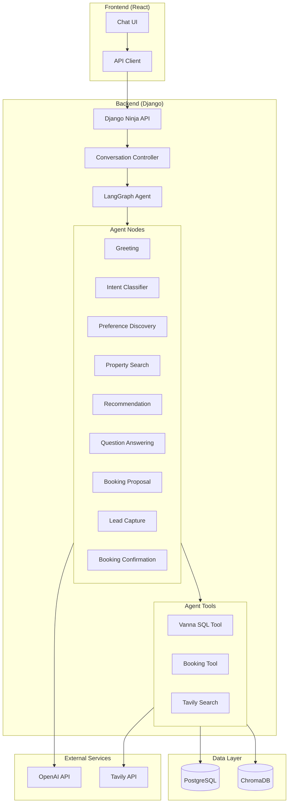
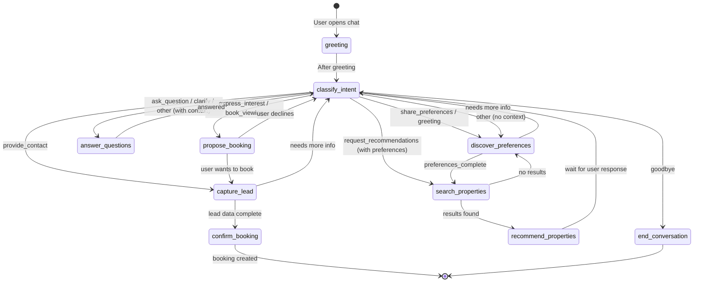
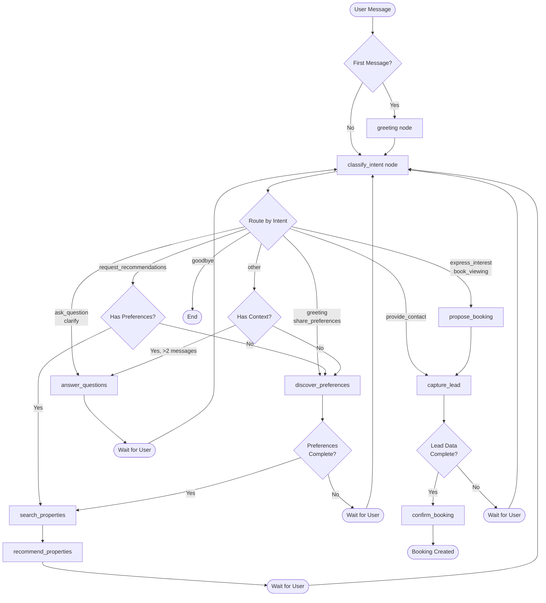
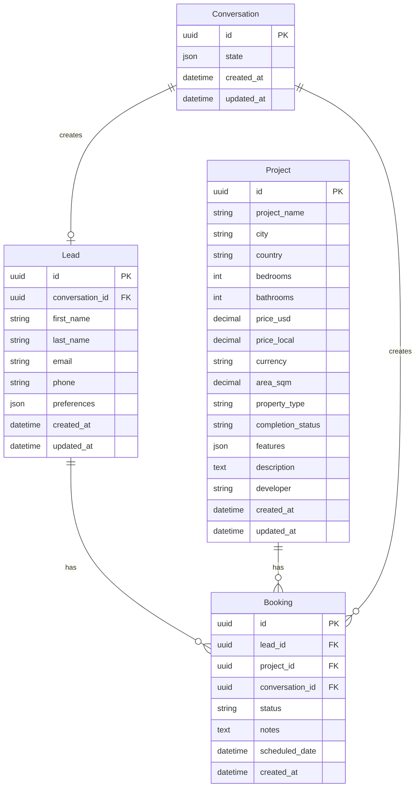
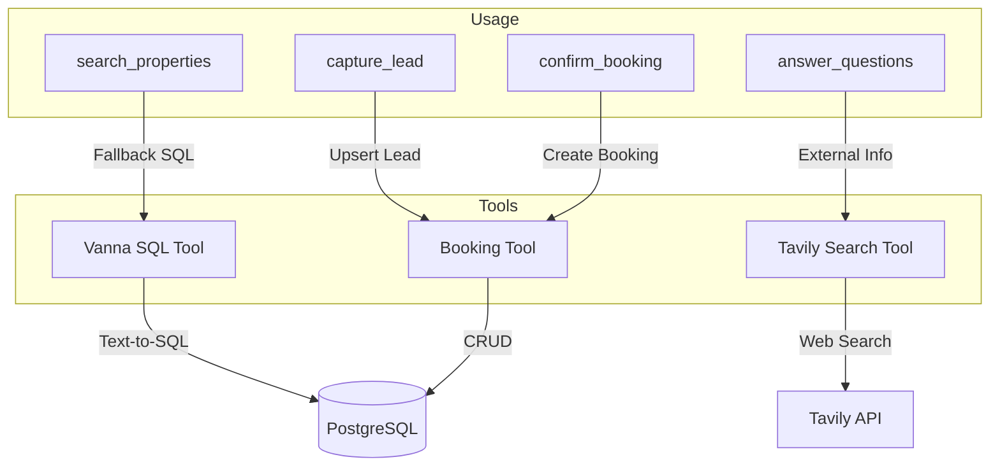
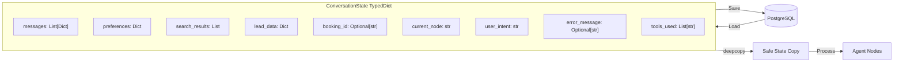
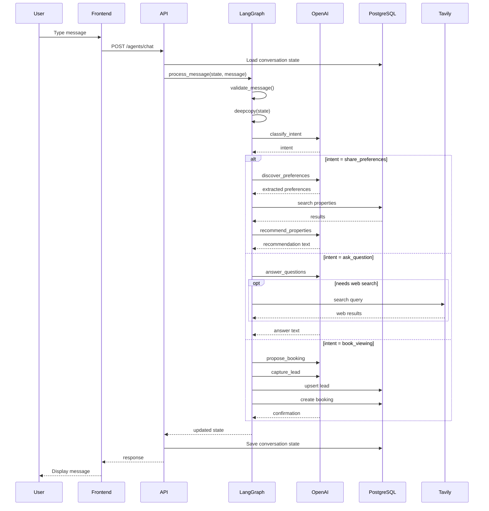
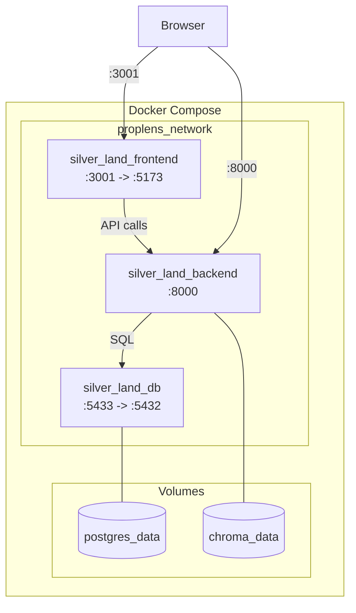

# Silver Land Properties - Architecture Documentation

## System Overview

Silver Land Properties is a conversational AI agent built with Django, LangGraph, and React. The agent helps users find properties, answer questions, and book viewings through natural language conversation.

## Technology Stack

| Layer | Technology |
|-------|------------|
| Frontend | React 18 + TypeScript + Vite |
| Backend | Django 5.0 + Django Ninja |
| AI Framework | LangGraph + LangChain |
| LLM | OpenAI GPT-4o-mini |
| Database | PostgreSQL 15 |
| Vector Store | ChromaDB (for Vanna SQL) |
| Web Search | Tavily API |
| Container | Docker + Docker Compose |

---

## High-Level Architecture



---

## LangGraph State Machine - Conversation Flow



---

## Detailed Node Flow with Routing Logic



---

## Data Models



---

## API Endpoints

```mermaid
flowchart LR
    subgraph API["REST API Endpoints"]
        subgraph Conversations
            POST1[POST /conversations/]
            GET1[GET /conversations/{id}]
        end

        subgraph Agent
            POST2[POST /agents/chat]
        end

        subgraph Health
            GET2[GET /health/]
        end
    end

    Client[Frontend] --> POST1
    Client --> GET1
    Client --> POST2
    Client --> GET2
```

### Endpoint Details

| Method | Endpoint | Description |
|--------|----------|-------------|
| POST | `/api/v1/conversations/` | Create new conversation |
| GET | `/api/v1/conversations/{id}` | Get conversation state |
| POST | `/api/v1/agents/chat` | Send message to agent |
| GET | `/api/v1/health/` | Health check |

---

## Agent Nodes Description

| Node | Purpose | Triggers |
|------|---------|----------|
| `greeting` | Welcome user, set tone | First message |
| `classify_intent` | Analyze user intent | Every message |
| `discover_preferences` | Extract property preferences | share_preferences, greeting |
| `search_properties` | Query database for matches | preferences complete |
| `recommend_properties` | Present results naturally | search results found |
| `answer_questions` | Answer user queries | ask_question intent |
| `propose_booking` | Initiate viewing booking | express_interest, book_viewing |
| `capture_lead` | Collect user contact info | provide_contact, booking flow |
| `confirm_booking` | Create and confirm booking | lead data complete |

---

## Tool Integration



---

## State Management (ConversationState)



---

## Request Flow Sequence



---

## Docker Architecture



---

## File Structure

```
proplens_assesment/
├── backend/
│   ├── src/
│   │   ├── agent/
│   │   │   ├── graph.py           # LangGraph definition
│   │   │   ├── state.py           # ConversationState
│   │   │   ├── nodes/             # All agent nodes
│   │   │   │   ├── greeting.py
│   │   │   │   ├── intent_classifier.py
│   │   │   │   ├── preference_discovery.py
│   │   │   │   ├── property_search.py
│   │   │   │   ├── recommendation.py
│   │   │   │   ├── question_answering.py
│   │   │   │   ├── booking_proposal.py
│   │   │   │   ├── lead_capture.py
│   │   │   │   └── booking_confirmation.py
│   │   │   ├── tools/             # Agent tools
│   │   │   │   ├── vanna_sql_tool.py
│   │   │   │   ├── booking_tool.py
│   │   │   │   └── tavily_search_tool.py
│   │   │   └── schemas.py         # Pydantic validation
│   │   ├── api/
│   │   │   └── controllers/       # API endpoints
│   │   ├── domain/
│   │   │   ├── models.py          # Django models
│   │   │   └── management/        # Import commands
│   │   └── config/
│   │       └── settings.py
│   └── Dockerfile
├── frontend/
│   ├── src/
│   │   ├── components/
│   │   │   └── Chat/
│   │   ├── services/
│   │   │   └── api.ts
│   │   └── App.tsx
│   └── Dockerfile
├── data/
│   └── Property_sales_agent_-_Challenge.csv
├── docker-compose.yml
├── .env
└── ARCHITECTURE.md
```

---

## Environment Configuration

| Variable | Description | Default |
|----------|-------------|---------|
| `OPENAI_API_KEY` | OpenAI API key | Required |
| `OPENAI_MODEL` | LLM model to use | gpt-4o-mini |
| `TAVILY_API_KEY` | Tavily search API key | Optional |
| `DB_HOST` | PostgreSQL host | db |
| `DB_PORT` | PostgreSQL port | 5432 |
| `DJANGO_DEBUG` | Debug mode | True |

---

## Key Design Decisions

1. **LangGraph for Orchestration**: Provides state machine with conditional routing, checkpointing, and easy debugging.

2. **Intent Classification First**: Every message goes through intent classification to determine the appropriate node.

3. **Progressive Lead Capture**: Contact info collected incrementally (first name → email → phone) without overwhelming users.

4. **Two-Tier Search**: Django ORM for primary search, Vanna SQL as fallback for complex queries.

5. **Web Search Fallback**: Tavily integration for external information (schools, transport, neighborhood).

6. **Deep Copy State**: Prevents race conditions when multiple requests modify state.

7. **Pydantic Validation**: Input sanitization for security and data integrity.

---

## Running the Application

```bash
# Start all services
docker-compose up -d

# Import property data
docker-compose exec backend sh -c "cd /app/src && python manage.py import_properties /app/data/Property_sales_agent_-_Challenge.csv"

# Access the application
# Frontend: http://localhost:3001
# Backend API: http://localhost:8000/api/v1/
# Health Check: http://localhost:8000/api/v1/health/
```
