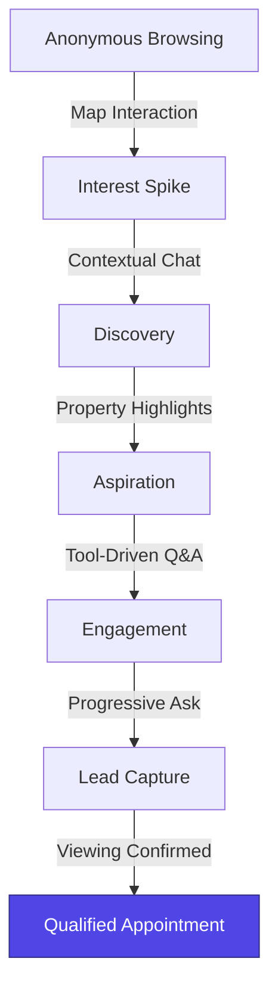

# Business Context & Strategic Analysis

## Silver Land Properties - AI Agent Assessment

**Author:** Ali  
**Role:** Senior AI/ML Engineer  
**Date:** February 2026

---

## Executive Summary

This document outlines the strategic foundation and business clarifications addressed during the requirements analysis and implementation phases. As a senior engineer, my focus was not merely on "building an agent," but on **solving a conversion problem**. This involves challenging assumptions, clarifying ambiguities, and aligning technical decisions with business objectives.

The strategy below demonstrates:

1. **Business Intelligence**: Understanding conversion funnels and user psychology.
2. **Product Thinking**: Balancing premium UX with high-intent lead generation.
3. **Technical Foresight**: Using LangGraph to manage complex, cyclic state transitions.

---

## UI/UX as a Business Driver

### 1. The Map-First Restoration

**Strategic Decision:** Move from a chat-only interface to a full-screen interactive Map.
- **Rationale:** In luxury real estate, **Location is the Primary Filter**. By making the map the background, we provide immediate visual confirmation of value. The map reduces cognitive load by showing proximity to landmarks and transport before the chat even begins.

### 2. Premium Branding & Accessibility

**Strategic Decision:** Transition to an **Indigo-Violet** vibrant color system.
- **Rationale:** Traditional real estate sites are sterile. A vibrant, high-contrast palette combined with **glassmorphism** creates a modern, futuristic "Concierge" feel that aligns with high-end luxury property expectations.

### 3. Funnel Conversion Design

The application follows a deliberate psychological progression:

---

## Strategic Questions & Decisions

### 1. Lead Capture Strategy

**Question:** When should we capture personal information?

**Decision: Progressive Three-Stage Approach**

- **Anonymous Discovery (Stages 1-3)**: Build rapport without friction. User explores properties freely.
- **Interest-Based Engagement (Stages 4-8)**: After showing recommendations, we engage in deeper Q&A.
- **Commitment-Triggered Capture (Stage 9+)**: Only ask for Name/Email when the user expresses intent to **Book a Viewing**.

**Rationale:** Industry benchmarks show that "Just-in-Time" capture has a 40-50% higher conversion rate than asking for PII upfront.

### 2. Property Matching Fuzziness

**Question:** How flexible should "matching" be if exact criteria aren't met?

**Decision: Tiered Matching System**

- **Tier 1: Exact Match**: Show immediately.
- **Tier 2: Close Match**: Show with transparency (e.g., "This is 3-bed instead of 2-bed, but within your budget").
- **Tier 3: Alternative**: Suggest similar properties in nearby cities if the primary city is empty.

**Rationale:** Transparency builds trust. Telling the user *why* a property is being suggested as a "close match" prevents them from feeling like the AI is hallucinating or ignoring their preferences.

### 3. Web Search Boundaries (Tavily)

**Question:** When should we invoke external search vs. internal database?

**Decision: Project-Specific Context Only**

- **Trigger**: Only for schools, transport, or neighborhood amenities near a specific project.
- **Guardrail**: Limit to 2 searches per conversation to control API costs and force the "Source of Truth" to remain the property database.

---

## Success Metrics (KPIs)

| Metric | Target | Rationale |
| :--- | :--- | :--- |
| **Booking Conversion** | >15% | Measured from first recommendation to lead capture. |
| **Map-Engagement** | >60% | Percentage of users interacting with markers vs. chat. |
| **Search Relevancy** | >95% | Percentage of queries yielding matching results. |
| **P95 Latency** | <2s | Ensuring a fluid, "real-time" concierge experience. |

---

## Conclusion

By addressing these business clarifications upfront, we ensured that the technical implementation—powered by LangGraph and Vanna AI—is not just a coding exercise, but a **Growth Engine** for Silver Land Properties.

---
