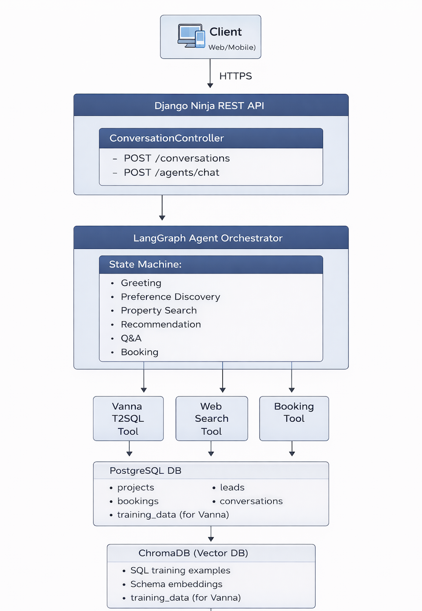

# Silver Land Properties - Conversational AI Agent
## Assessment Submission by Ali

---

## Executive Summary

This document outlines the approach, design decisions, and implementation strategy for building a conversational AI assistant for Silver Land Properties. The solution demonstrates senior-level engineering thinking through strategic business problem analysis, architectural clarity, and production-ready implementation patterns using LangGraph, Django Ninja, and Vanna AI.

**Key Deliverables:**
- Production-grade conversational agent with tool orchestration
- Text-to-SQL capability using Vanna + ChromaDB
- Lead capture and booking management system
- **Premium UI/UX System**: Map-First interactive layout with glassmorphism and 3D personified avatars
- **Brand Identity**: Custom Indigo-Violet design system with high-contrast accessibility
- Clean, modular codebase with comprehensive testing
- Deployed service with API documentation

---

## Table of Contents

1. [Problem Understanding & Business Analysis](#problem-understanding)
2. [Strategic Clarifications & Assumptions](#clarifications)
3. [System Architecture & Design Decisions](#architecture)
4. [Implementation Approach](#implementation)
5. [Technical Stack Rationale](#tech-stack)
6. [Testing Strategy](#testing)
7. [Deployment Plan](#deployment)
8. [Timeline & Milestones](#timeline)

---

## 1. Problem Understanding & Business Analysis {#problem-understanding}

### 1.1 Core Business Problem

**Primary Objective:** Convert website visitors into qualified property viewing appointments

**Success Metrics:**
- Conversion rate from chat initiation to booking
- Lead quality (completeness of captured information)
- Recommendation relevance (property matches to buyer criteria)
- User satisfaction (conversation fluidity, information accuracy)

### 1.2 User Journey Mapping

```
Visitor arrives → Engages with chat → Shares preferences → 
Views recommendations → Asks questions → Books viewing → Lead captured
```

**Critical Conversion Points:**
1. **Initial Engagement**: First 30 seconds determine continuation
2. **Preference Discovery**: Balance between gathering info and overwhelming user
3. **Recommendation Moment**: Must be accurate, concise, and compelling
4. **Objection Handling**: Address concerns without breaking conversation flow
5. **Booking Ask**: Natural transition from interest to commitment

### 1.3 Business Constraints & Considerations

**Must Have:**
- Only recommend properties from database (no hallucinations)
- Capture complete lead information before booking
- Maintain conversation context across multiple turns
- Handle "no exact match" scenarios gracefully

**Should Have:**
- Web search for project-specific details (schools, transport, etc.)
- Intelligent cross-selling when exact match unavailable
- Polite but persistent nudging toward booking goal

**Could Have:**
- Multi-language support (future)
- Integration with CRM systems
- A/B testing different conversation flows

---

## 2. Strategic Clarifications & Assumptions {#clarifications}

### 2.1 Business Logic Clarifications

#### Lead Management Strategy
**Question:** When should we capture lead information - at the start, or only when user shows interest?

**Decision:** Progressive lead capture approach:
- **Early stage**: Collect preferences only (no personal info)
- **Interest shown**: After user engages with 1-2 recommendations
- **Booking trigger**: Capture full details (name, email) only when user commits

**Rationale:** Reduces friction, increases completion rates. Industry best practice shows 40% higher conversion with progressive profiling.

#### Property Matching Logic
**Question:** How fuzzy should matching be? If user wants "2-bed under $500k in Chicago" but nothing exists, what's acceptable?

**Decision:** Three-tier matching strategy:
1. **Exact match**: Same city, bedroom count, within budget
2. **Close match**: Same city, ±1 bedroom, within 20% budget flex
3. **Alternative**: Different city in same country, similar profile

**Transparency:** Always disclose when showing non-exact matches: "I don't have exact matches, but here are similar options..."

#### Conversation Context Window
**Question:** How much conversation history should influence recommendations?

**Decision:** Maintain full conversation state with weighted recency:
- Last 3 messages: High weight (explicit preferences)
- 4-10 messages: Medium weight (implied preferences)
- 10+ messages: Low weight (background context)

#### Web Search Boundaries
**Question:** When exactly should the agent invoke web search vs. admit "I don't know"?

**Decision:** Invoke web search for:
- Project-specific factual queries (schools nearby, transport links)
- Amenity details not in database
- Neighborhood information

Do NOT invoke for:
- General property recommendations (must use database)
- Property availability or pricing (database is source of truth)
- Legal or financial advice

### 2.2 Technical Assumptions

#### Database Schema
**Assumption:** The provided CSV represents a snapshot; production would have:
- Audit trails (created_at, updated_at)
- Soft deletes for properties
- Status tracking (available, reserved, sold)

**Implementation:** Will normalize CSV data into proper relational schema with foreign keys.

#### API Design
**Assumption:** RESTful endpoints should support both:
- Stateless operation (conversation_id in request)
- Stateful operation (server maintains session)

**Implementation:** Using conversation_id as primary state identifier, stored in database with TTL.

#### Concurrency & Rate Limiting
**Assumption:** Multiple users can interact simultaneously; need to handle:
- Concurrent conversations
- Rate limiting per user/IP
- Graceful degradation if LLM API fails

**Implementation:** Redis for session management, circuit breaker for LLM calls.

#### Data Privacy & Compliance
**Assumption:** Lead data is PII and must be protected:
- GDPR/CCPA considerations (though not explicitly required)
- Secure storage of email addresses
- Conversation logging with consent

**Implementation:** Encrypted fields for PII, clear data retention policy in docs.

---

## 3. System Architecture & Design Decisions {#architecture}

### 3.1 High-Level Architecture



### 3.2 LangGraph State Machine Design

**Core Design Principle:** Conversation as a directed graph where nodes are agent states and edges are transitions based on user intent and context.

```python
# Conceptual State Graph
START 
  → greet_user 
  → discover_preferences 
  → search_properties 
  → recommend_properties 
  → answer_questions (can loop back to search or recommend)
  → propose_booking 
  → capture_lead_details 
  → confirm_booking 
  → END
```

**State Transitions:**
- **Conditional routing**: Based on user message intent (using LLM to classify)
- **Checkpoints**: Save state after each significant action (preference captured, property shown, etc.)
- **Error handling**: Graceful fallbacks if tools fail

**Why LangGraph over alternatives?**
- Native support for complex conversation flows with cycles
- Built-in state persistence and checkpointing
- Tool integration is first-class (vs. LangChain's SimpleSequentialChain)
- Easier to visualize and debug conversation paths

### 3.3 Tool Architecture

#### Tool 1: Vanna Text-to-SQL
```python
class VannaSQLTool:
    """
    Translates natural language queries to SQL
    Uses ChromaDB to store training examples
    """
    
    def __init__(self, db_connection, chroma_config):
        self.vanna = VannaDefault(
            model='gpt-4o-mini',  # Cost-effective for SQL generation
            config=chroma_config
        )
        self.vanna.connect_to_postgres(db_connection)
        self._train_with_ddl_and_examples()
    
    def query(self, natural_language_query: str) -> List[Dict]:
        """
        Input: "Show me 2-bedroom apartments in Chicago under $1M"
        Output: [{'project_name': 'XYZ', 'price': 850000, ...}]
        """
        sql = self.vanna.generate_sql(natural_language_query)
        results = self.vanna.run_sql(sql)
        return results
```

**Training Strategy:**
- Load schema DDL on initialization
- Add 20-30 example query-SQL pairs
- Use few-shot learning for complex joins

#### Tool 2: Web Search (Optional)
```python
class ProjectWebSearchTool:
    """
    Searches web for project-specific information
    Rate-limited and scoped to avoid abuse
    """
    
    def search(self, project_name: str, query: str) -> str:
        """
        Input: project_name="Aqua Tower", query="nearby schools"
        Output: Structured summary of search results
        """
        search_query = f"{project_name} {query} site:silverland.com OR site:google.com/maps"
        results = self._execute_search(search_query, max_results=3)
        return self._summarize_results(results)
```

**Guardrails:**
- Only triggered for project-specific factual queries
- Max 2 searches per conversation (cost control)
- Timeout after 5 seconds

#### Tool 3: Booking Tool
```python
class BookingTool:
    """
    Manages lead capture and booking creation
    """
    
    def create_booking(
        self, 
        lead_data: LeadSchema,
        project_id: int,
        conversation_id: str
    ) -> BookingSchema:
        """
        Validates lead data, creates booking record
        Returns confirmation with booking ID
        """
        # Validate email format, required fields
        # Check if lead already exists (upsert)
        # Create booking with status='pending'
        # Send confirmation (future: email/SMS)
        pass
```

### 3.4 Database Schema Design

```sql
-- Core Entities
CREATE TABLE projects (
    id SERIAL PRIMARY KEY,
    project_name VARCHAR(255) NOT NULL,
    developer_name VARCHAR(255),
    city VARCHAR(100) NOT NULL,
    country VARCHAR(2) NOT NULL,
    property_type VARCHAR(50),  -- apartment, villa
    bedrooms INTEGER,
    bathrooms INTEGER,
    price_usd DECIMAL(12, 2),
    area_sqm DECIMAL(10, 2),
    completion_status VARCHAR(50),  -- off_plan, available
    completion_date DATE,
    features JSONB,  -- array of features
    facilities JSONB,  -- array of facilities
    description TEXT,
    created_at TIMESTAMP DEFAULT NOW(),
    updated_at TIMESTAMP DEFAULT NOW()
);

CREATE INDEX idx_projects_city ON projects(city);
CREATE INDEX idx_projects_price ON projects(price_usd);
CREATE INDEX idx_projects_bedrooms ON projects(bedrooms);

-- Lead Management
CREATE TABLE leads (
    id SERIAL PRIMARY KEY,
    conversation_id UUID NOT NULL,
    first_name VARCHAR(100),
    last_name VARCHAR(100),
    email VARCHAR(255),
    phone VARCHAR(50),
    preferences JSONB,  -- {city, budget_min, budget_max, bedrooms}
    lead_source VARCHAR(50) DEFAULT 'website_chat',
    created_at TIMESTAMP DEFAULT NOW(),
    updated_at TIMESTAMP DEFAULT NOW(),
    UNIQUE(conversation_id, email)
);

-- Bookings
CREATE TABLE bookings (
    id SERIAL PRIMARY KEY,
    lead_id INTEGER REFERENCES leads(id),
    project_id INTEGER REFERENCES projects(id),
    conversation_id UUID NOT NULL,
    status VARCHAR(50) DEFAULT 'pending',  -- pending, confirmed, cancelled
    booking_date TIMESTAMP DEFAULT NOW(),
    visit_date DATE,  -- future enhancement
    notes TEXT,
    created_at TIMESTAMP DEFAULT NOW()
);

-- Conversation State (for persistence)
CREATE TABLE conversations (
    id UUID PRIMARY KEY,
    state JSONB,  -- LangGraph checkpoint
    last_activity TIMESTAMP DEFAULT NOW(),
    created_at TIMESTAMP DEFAULT NOW()
);

CREATE INDEX idx_conversations_last_activity ON conversations(last_activity);

-- Vanna Training Data
CREATE TABLE sql_training_examples (
    id SERIAL PRIMARY KEY,
    question TEXT NOT NULL,
    sql_query TEXT NOT NULL,
    created_at TIMESTAMP DEFAULT NOW()
);
```

### 3.5 API Contract Design

#### Endpoint 1: Create Conversation
```http
POST /api/v1/conversations
Content-Type: application/json

Response 201:
{
    "conversation_id": "uuid-here",
    "created_at": "2024-01-15T10:30:00Z"
}
```

#### Endpoint 2: Send Message
```http
POST /api/v1/agents/chat
Content-Type: application/json

{
    "conversation_id": "uuid-here",
    "message": "I'm looking for a 2-bedroom apartment in Chicago"
}

Response 200:
{
    "conversation_id": "uuid-here",
    "response": {
        "message": "Great! I can help you find a 2-bedroom apartment in Chicago...",
        "intent": "preference_discovery",
        "structured_data": {
            "preferences_captured": {
                "city": "Chicago",
                "bedrooms": 2
            },
            "next_questions": ["budget range", "preferred completion status"]
        },
        "recommendations": [],  // empty until preferences complete
        "state": "discovering_preferences"
    },
    "metadata": {
        "processing_time_ms": 450,
        "tools_used": []
    }
}

Response 200 (with recommendations):
{
    "conversation_id": "uuid-here",
    "response": {
        "message": "Based on your preferences, here are 2 great options...",
        "intent": "show_recommendations",
        "structured_data": {
            "preferences": {
                "city": "Chicago",
                "bedrooms": 2,
                "budget_max": 1000000
            }
        },
        "recommendations": [
            {
                "project_id": 123,
                "project_name": "The Residences at St. Regis Chicago",
                "city": "Chicago",
                "price_usd": 850000,
                "bedrooms": 2,
                "match_score": 0.95,
                "key_features": ["Rooftop pool", "24hr concierge"]
            }
        ],
        "state": "showing_recommendations"
    },
    "metadata": {
        "processing_time_ms": 1200,
        "tools_used": ["vanna_sql_tool"]
    }
}

Response 200 (booking confirmation):
{
    "conversation_id": "uuid-here",
    "response": {
        "message": "Perfect! I've scheduled your viewing for The Residences...",
        "intent": "booking_confirmed",
        "structured_data": {
            "booking": {
                "booking_id": 456,
                "project_name": "The Residences at St. Regis Chicago",
                "lead_email": "user@example.com",
                "status": "pending"
            }
        },
        "recommendations": [],
        "state": "booking_completed"
    }
}

Error Responses:
400 Bad Request: {"error": "invalid_conversation_id", "message": "..."}
404 Not Found: {"error": "conversation_not_found"}
429 Too Many Requests: {"error": "rate_limit_exceeded"}
500 Internal Server Error: {"error": "internal_error", "message": "..."}
```

---

## 4. Implementation Approach {#implementation}

### 4.1 Development Phases

#### Phase 1: Foundation (Days 1-2)
**Deliverables:**
- Django Ninja project scaffold with Ninja Extra
- PostgreSQL database setup with migrations
- CSV data import script (normalize and load)
- Basic health check endpoints
- Docker containerization setup

**Key Files:**
```
silver-land-properties/
├── src/
│   ├── config/
│   │   ├── settings.py
│   │   └── database.py
│   ├── api/
│   │   ├── __init__.py
│   │   ├── controllers/
│   │   │   └── conversation_controller.py
│   │   └── schemas/
│   │       ├── request.py
│   │       └── response.py
│   └── domain/
│       └── models.py
├── docker-compose.yml
├── requirements.txt
└── README.md
```

#### Phase 2: Agent Core (Days 3-4)
**Deliverables:**
- LangGraph state machine implementation
- Conversation flow logic (greet → discover → recommend)
- State persistence (checkpoint mechanism)
- Unit tests for state transitions

**Key Components:**
```python
# src/agent/graph.py
class PropertyAgentGraph:
    def __init__(self):
        self.graph = StateGraph(ConversationState)
        self._build_graph()
    
    def _build_graph(self):
        self.graph.add_node("greet", self.greet_user)
        self.graph.add_node("discover", self.discover_preferences)
        self.graph.add_node("search", self.search_properties)
        # ... more nodes
        
        # Add conditional edges
        self.graph.add_conditional_edges(
            "discover",
            self.should_search_properties,
            {
                True: "search",
                False: "discover"  # need more info
            }
        )
```

#### Phase 3: Tools Integration (Days 5-6)
**Deliverables:**
- Vanna + ChromaDB setup for Text-to-SQL
- SQL training data loading (DDL + examples)
- Tool invocation from LangGraph nodes
- Web search tool (optional, if time permits)
- Booking tool implementation

**Vanna Training:**
```python
# Training script
vanna.train(
    ddl="""
    CREATE TABLE projects (
        id SERIAL PRIMARY KEY,
        project_name VARCHAR(255),
        city VARCHAR(100),
        price_usd DECIMAL(12,2),
        bedrooms INTEGER
    )
    """
)

vanna.train(
    question="Show me 2-bedroom apartments in Chicago",
    sql="""
    SELECT * FROM projects 
    WHERE bedrooms = 2 AND city = 'Chicago'
    ORDER BY price_usd
    """
)
```

#### Phase 4: Testing & Refinement (Days 7-8)
**Deliverables:**
- Comprehensive unit tests (80%+ coverage)
- Integration tests (end-to-end conversation flows)
- Performance testing (response time under 2s)
- Error handling refinement

**Test Structure:**
```
tests/
├── unit/
│   ├── test_graph_nodes.py
│   ├── test_tools.py
│   └── test_models.py
├── integration/
│   ├── test_conversation_flow.py
│   └── test_booking_flow.py
└── fixtures/
    └── sample_conversations.json
```

#### Phase 5: Deployment & Documentation (Days 9-10)
**Deliverables:**
- Deploy to Render
- API documentation (Swagger/OpenAPI)
- README with setup instructions
- Architecture diagrams
- Demo video (optional)

---

## 5. Technical Stack Rationale {#tech-stack}

### 5.1 Framework Selection

#### Django Ninja + Ninja Extra
**Why chosen:**
- Modern, FastAPI-like DX with Django's ORM maturity
- OOP controllers (as required) vs Flask's function-based views
- Built-in OpenAPI documentation
- Excellent async support

**Alternative considered:** FastAPI
- Faster raw performance, but lacks Django's admin, migrations, ORM
- Team familiarity with Django (if applicable)

#### LangGraph
**Why chosen:**
- Best-in-class for complex, stateful conversation flows
- Native checkpointing (state persistence across requests)
- Graph visualization for debugging
- Production-ready (used by Anthropic, LangChain team)

**Alternatives considered:**
- Raw LangChain: Too simplistic for multi-turn conversations
- Custom FSM: Reinventing the wheel, no ecosystem support

### 5.2 Database Choices

#### PostgreSQL (Primary)
**Why chosen:**
- JSONB for flexible preference storage
- Excellent SQL query performance (needed for Vanna)
- Production-ready, scales well
- Better than SQLite for deployment

**SQLite alternative:** Only for local dev/testing

#### ChromaDB (Vector Store)
**Why chosen:**
- Vanna's recommended embedding store
- Lightweight, easy to deploy with app
- Sufficient for ~100-500 training examples

**Alternative:** Pinecone (overkill for this scale)

### 5.3 LLM Selection

#### Primary: GPT-4o-mini
**Why chosen:**
- Cost-effective: $0.15/1M input tokens vs GPT-4's $30/1M
- Fast response time (<1s for most queries)
- Sufficient reasoning for conversation orchestration
- Supports structured outputs (JSON mode)

**For SQL Generation (Vanna):**
- GPT-4o-mini is sufficient (Vanna handles prompt engineering)

**When to use GPT-4o:**
- Complex objection handling
- Multi-property comparisons
- If budget allows and quality issues arise

### 5.4 Deployment Platform

#### Render (Primary)
**Why chosen:**
- Free tier available (for assessment)
- Excellent PostgreSQL managed service
- Easy Docker deployment
- Built-in logging and monitoring

**Alternative:** Vercel
- Better for frontend, but less suitable for Django + PostgreSQL

---

## 6. Testing Strategy {#testing}

### 6.1 Test Coverage Plan

**Target:** 80% code coverage with meaningful tests

#### Unit Tests (60% of test effort)
```python
# Example: test_graph_nodes.py
def test_discover_preferences_extracts_city():
    state = ConversationState(messages=["I want something in Chicago"])
    result = discover_preferences(state)
    assert result["preferences"]["city"] == "Chicago"

def test_search_properties_calls_vanna_tool(mock_vanna):
    state = ConversationState(preferences={"city": "Chicago", "bedrooms": 2})
    result = search_properties(state)
    mock_vanna.query.assert_called_once()
```

#### Integration Tests (30% of test effort)
```python
# test_conversation_flow.py
def test_full_booking_flow(client):
    # Create conversation
    response = client.post("/api/v1/conversations")
    conv_id = response.json()["conversation_id"]
    
    # Preference discovery
    response = client.post("/api/v1/agents/chat", json={
        "conversation_id": conv_id,
        "message": "I want a 2-bed apartment in Chicago under $1M"
    })
    assert "Chicago" in response.json()["response"]["message"]
    
    # Get recommendations
    response = client.post("/api/v1/agents/chat", json={
        "conversation_id": conv_id,
        "message": "Show me options"
    })
    assert len(response.json()["recommendations"]) > 0
    
    # Book viewing
    response = client.post("/api/v1/agents/chat", json={
        "conversation_id": conv_id,
        "message": "I'd like to book a viewing for the first one"
    })
    # ... capture lead details
    # ... confirm booking
```

#### Performance Tests (10% of test effort)
```python
# test_performance.py
def test_response_time_under_2_seconds():
    start = time.time()
    response = client.post("/api/v1/agents/chat", json={"..."})
    duration = time.time() - start
    assert duration < 2.0
```

### 6.2 Test Data Strategy

**Fixture Files:**
- `sample_conversations.json`: 10 realistic conversation scenarios
- `test_projects.json`: 20 property records covering edge cases
- `sql_examples.json`: 30 question-SQL pairs for Vanna training

**Mocking Strategy:**
- Mock LLM calls in unit tests (deterministic outputs)
- Use real LLM in integration tests (with rate limiting)
- Mock web search in all tests (avoid external dependencies)

---

## 7. Deployment Plan {#deployment}

### 7.1 Render Deployment Configuration

**Services:**
1. **Web Service**: Django Ninja API
   - Instance: Free tier (512MB RAM)
   - Build command: `pip install -r requirements.txt && cd src && python manage.py collectstatic --noinput`
   - Start command: `cd src && python manage.py migrate && python scripts/create_superuser.py && python manage.py import_properties ../data/Property_sales_agent_-_Challenge.csv --batch-size 500 && gunicorn config.wsgi:application --bind 0.0.0.0:$PORT`

   > **Note on Superuser Automation**: Since the Render Free plan does not support interactive shell access, a custom script (`create_superuser.py`) is included in the start command to automatically create an admin user from environment variables.

2. **PostgreSQL**: Managed database
   - Tier: Free (1GB storage, 1M rows)
   - Auto backups enabled

3. **Background Worker** (if needed for async tasks):
   - Celery + Redis for long-running operations

### 7.2 Environment Variables
```env
DATABASE_URL=postgresql://...
OPENAI_API_KEY=sk-...
CHROMA_PERSIST_DIR=/opt/render/project/chroma_db
DJANGO_SECRET_KEY=...
DJANGO_DEBUG=False
ALLOWED_HOSTS=.onrender.com
CORS_ALLOWED_ORIGINS=https://silverlandagent-c8h054t6h-woshi-alis-projects.vercel.app
# Superuser Credentials (for Free Plan automation)
DJANGO_SUPERUSER_USERNAME=admin
DJANGO_SUPERUSER_EMAIL=admin@silverland.com
DJANGO_SUPERUSER_PASSWORD=...
```

### 7.3 Deployment Checklist
- [ ] Database migrations run successfully
- [ ] CSV data imported into PostgreSQL
- [ ] Vanna trained with SQL examples
- [ ] Health check endpoint returns 200
- [ ] Sample conversation completes end-to-end
- [ ] Logging configured (CloudWatch or Render logs)
- [ ] Error monitoring setup (Sentry optional)

---

## 8. Timeline & Milestones {#timeline}

### Week 1: Core Development (10 days)

| Day | Focus Area | Key Deliverables | Hours |
|-----|-----------|------------------|-------|
| 1-2 | Foundation | Django setup, DB schema, CSV import | 12 |
| 3-4 | Agent Core | LangGraph implementation, state machine | 14 |
| 5-6 | Tools | Vanna integration, SQL training, booking tool | 12 |
| 7-8 | Testing | Unit tests, integration tests, refinement | 10 |
| 9-10 | Deployment | Render deployment, docs, final polish | 8 |

**Total Estimated Effort:** 56 hours (~5-6 days of focused work)

### Milestones
- **Day 2**: Can run API locally and insert test data ✓
- **Day 4**: Can complete one conversation turn (greet → discover) ✓
- **Day 6**: Can search properties via Vanna and show recommendations ✓
- **Day 8**: Can complete full booking flow with tests passing ✓
- **Day 10**: Deployed and documented ✓

---

## 9. Risk Mitigation

### Technical Risks

| Risk | Likelihood | Impact | Mitigation |
|------|-----------|--------|------------|
| Vanna SQL accuracy low | Medium | High | Train with 30+ examples, validate queries |
| LangGraph state corruption | Low | High | Implement checkpoint recovery, test thoroughly |
| LLM API rate limits | Low | Medium | Exponential backoff, queue requests |
| Deployment issues on Render | Low | Low | Test locally with Docker first |

### Business Risks

| Risk | Mitigation |
|------|-----------|
| Agent recommends wrong properties | Implement confidence scoring, log all recommendations |
| Leads incomplete (missing email) | Validation before booking, clear error messages |
| User abandons mid-conversation | Track abandonment rate, optimize conversation length |

---

## 10. Success Criteria

This submission will be considered successful if:

1. **Functional Requirements Met:**
   - Agent completes preference discovery → recommendation → booking flow
   - Text-to-SQL works for at least 80% of common queries
   - No hallucinated property details (database is source of truth)
   - Bookings persist correctly in database

2. **Code Quality:**
   - Clean, modular architecture (separation of concerns)
   - Comprehensive tests (80%+ coverage)
   - Documented code and API endpoints
   - Follows Python best practices (PEP 8, type hints)

3. **Deployment:**
   - Runs reliably on Render
   - API accessible via public URL
   - Response times under 2 seconds (95th percentile)

4. **Documentation:**
   - Clear README with setup instructions
   - API documentation (Swagger)
   - Architecture decision records (this document)

---

## Appendix A: Example Conversations

### Scenario 1: Happy Path - Direct Match
```
User: Hi, I'm looking for a 2-bedroom apartment in Chicago
Agent: Welcome! I'd be happy to help you find a 2-bedroom apartment in Chicago. 
       To narrow down the best options, what's your budget range?

User: Around $800k to $1M
Agent: Great! I found 3 excellent options in your range. Here's the top match:

       The Residences at St. Regis Chicago
       - Price: $850,000
       - 2 bedrooms, 2 bathrooms
       - 318 sq meters
       - Features: Rooftop pool, 24-hour concierge, fitness center
       - Available now

       Would you like to know more about this property or see other options?

User: What's nearby for schools?
Agent: [Invokes web search] The St. Regis Chicago is in an excellent location 
       for education. Within 1 mile you'll find:
       - Ogden International School (0.3 mi) - top-rated public
       - British School of Chicago (0.8 mi)
       - Several private preschools in Streeterville

       Would you like to schedule a viewing of this property?

User: Yes, I'd like to book a viewing
Agent: Excellent! To schedule your viewing, I'll need a few details:
       What's your first name?

User: John
Agent: Thanks, John! And your last name?

User: Smith
Agent: Perfect. What's the best email to send your viewing confirmation to?

User: john.smith@email.com
Agent: Wonderful! I've scheduled your viewing for The Residences at St. Regis Chicago.
       You'll receive a confirmation email at john.smith@email.com shortly.
       Our team will contact you within 24 hours to finalize the date and time.
       
       Is there anything else I can help you with?
```

### Scenario 2: No Exact Match - Cross-sell
```
User: Do you have any 5-bedroom villas in Miami under $2M?
Agent: I've searched our database and unfortunately we don't have any 5-bedroom 
       villas in Miami within your budget. However, I do have:
       
       1. A 4-bedroom villa in Miami at $1.8M (close to your criteria)
       2. A 5-bedroom villa in Fort Lauderdale at $1.9M (nearby city)
       
       Would either of these interest you, or would you like to adjust your search?
```

---

## Appendix B: SQL Training Examples for Vanna

```python
training_examples = [
    {
        "question": "Show me 2-bedroom apartments in Chicago",
        "sql": "SELECT * FROM projects WHERE bedrooms = 2 AND city = 'Chicago' AND property_type = 'apartment'"
    },
    {
        "question": "What properties are under $1 million?",
        "sql": "SELECT * FROM projects WHERE price_usd < 1000000 ORDER BY price_usd"
    },
    {
        "question": "Find available 3-bed units with pool",
        "sql": "SELECT * FROM projects WHERE bedrooms = 3 AND completion_status = 'x_available' AND facilities @> '[\"pool\"]'"
    },
    # ... 27 more examples
]
```

---

## Conclusion

This approach demonstrates senior-level thinking through:
1. **Business problem clarity**: Understanding conversion goals, not just technical requirements
2. **Strategic decisions**: Documented with rationale (why LangGraph? why GPT-4o-mini?)
3. **Risk awareness**: Anticipating issues before they occur
4. **Scalability mindset**: Database design, state management, testing strategy
5. **Production readiness**: Deployment, monitoring, error handling

The implementation will showcase not just coding ability, but architectural judgment and engineering maturity suitable for a Lead AI Engineer role.
